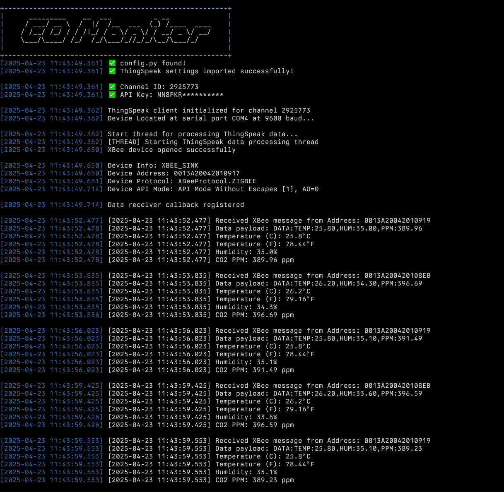

# XBee CO2 Monitoring System - Receiver Node

## Overview
This project implements a CO2 monitoring system using XBee radios in API mode. The receiver node collects sensor data (temperature, humidity, and CO2 PPM) from remote transmitter nodes and uploads it to ThingSpeak cloud for visualization and analysis.

## Features
- Wireless reception of sensor data from XBee transmitter nodes
- XBee API mode communication for reliable data transfer
- Real-time data display in terminal with color-coded output
- Automatic data averaging and upload to ThingSpeak cloud
- Configurable sampling and upload intervals
- Comprehensive logging with both text and JSON formats
- Duplicate message detection to prevent data spikes
- Support for multi-node networks with sender identification

## Hardware Requirements
- XBee Series 1 or Series 2 radio module (configured in API mode)
- USB-to-Serial adapter or XBee development board
- Computer running Python 3.6+

## Software Dependencies
- Python 3.6 or higher
- `digi-xbee` library for XBee communication
- `thingspeak` library for cloud integration
- Standard Python libraries: time, datetime, logging, os, json, threading, queue, traceback

## Installation

1. Clone this repository or download the script
2. Install required dependencies:
```
pip install digi-xbee thingspeak
```

3. Configure your XBee module in API mode (AP=1 or AP=2)
4. Update the configuration settings in the script:
   - Serial port (default: `COM4`)
   - Baud rate (default: `9600`)
   - ThingSpeak channel ID and write API key

## Usage

Run the script with Python:
```
python xbee_receiver.py
```

The receiver will:
1. Initialize the XBee device and ThingSpeak client
2. Start two threads:
   - Main thread for receiving and processing XBee messages
   - Background thread for averaging and uploading data to ThingSpeak

### Console Output

Here is an example of the live console output during operation:



## Data Format

The transmitter nodes should send data in the following format:

## Data Format

The transmitter nodes should send data in the following format:

```
DATA:TEMP:26,HUM:28,PPM:1421
```

Where:
- `TEMP` is the temperature in Celsius
- `HUM` is the relative humidity percentage
- `PPM` is the CO2 concentration in parts per million

## ThingSpeak Integration

The system automatically uploads data to ThingSpeak using the following fields:
- Field 1: Temperature (°C)
- Field 2: Humidity (%)
- Field 3: CO2 PPM
- Field 4: Temperature (°F)

Data is averaged over a 15-second interval before being uploaded to ThingSpeak, respecting the platform's rate limits.

## Logging

The system generates two log files:
- `Xbee.log`: Text-based log with timestamp, log level, and messages
- `Xbee.json`: JSON-formatted log for machine readability

## Troubleshooting

- **No data received**: Verify XBee configuration, especially API mode setting (AP parameter)
- **Connection errors**: Check COM port settings and ensure XBee is properly connected
- **Parsing errors**: Verify transmitter is sending data in the correct format
- **ThingSpeak upload failures**: Check internet connection and API key validity

## Advanced Configuration

The script supports multiple advanced configurations:

### Multi-node Networks

For networks with multiple transmitter nodes, the system automatically identifies and tracks each sender by its 64-bit address.

### Custom API Mode

The script supports both API modes:
- API Mode Without Escapes (AP=1)
- API Mode With Escapes (AP=2)

### Rate Limiting

The script respects ThingSpeak's rate limiting by enforcing a minimum interval between updates.

## License

This project is open-source and available under the MIT License.

## Contributing

Contributions to improve the system are welcome. Please feel free to submit a pull request or open an issue.